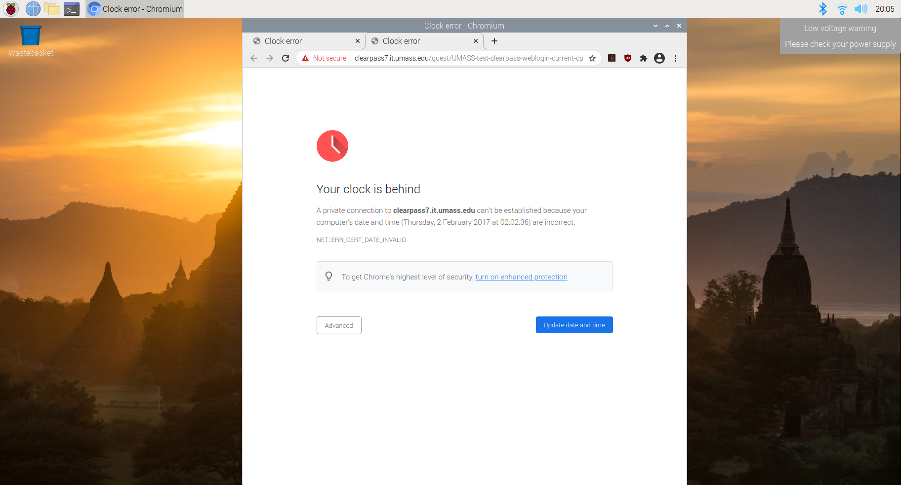

# This guide is for Raspberry Pis connecting to eduroam at UMass Amherst running Raspbian OS

Try reading this guide first on Github, if that does not suite you continue reading this guide below.

Try connecting to the UMASS network by hitting the network icon here:


Open a browser and go to umass.edu

If when you login, you do not seem to connect, the time settings on the raspberry pi may need to be reconfigured. You can tell this if you open a new tab, try and visit a webpage, and it shows this:


Either click the update buttons on chrome for date and time or, if that's not available, open the terminal on the menu bar:

and type the following command (replace YYYY with year, MM with month, and so on. **HH must be in 24hr time**):

```bash
sudo date -s 'YYYY-MM-DD HH:MM:SS'
```

If you see the updated date in the terminal below where you put in the command, great you date is now configured, try reloading the webpage.
If you do not see this error, move on to the next step

## Next step, fix wpa supplicant

* To get the Raspberry Pi to connect to the eduroam network, a configuration file called the ‘wpa_supplicant’ must be configured correctly
below is the command for configuring this file appropriately. **Please fill in your NETID and password** into marked fields.

### If you don't feel comfortable doing this, try looking at the script below instead.

Inside: */etc/wpa_supplicant/wpa_supplicant.conf*

```bash
ctrl_interface=DIR=/var/run/wpa_supplicant GROUP=netdev
update_config=1
country=US
network={
    ssid="eduroam"
    proto=RSN
    key_mgmt=WPA-EAP
    pairwise=CCMP
    auth_alg=OPEN
    eap=TTLS
    identity="NETID@umass.edu"
    anonymous_identity="NETID@umass.edu"
    password="NETIDPASSWORD"
    phase2="auth=PAP"
}
```

#### **Handy script**: 
that will try and do that for you. You can get this on your computer by doing

```bash
git clone https://github.com/jack-champagne/raspi-eduroam/raspi-eduroam.git
```

and then navigating into the folder called *raspi-eduroam*
and then running the commands at the top of the file as you see them (which should be these)

```bash
chmod +x cfg-wpa.sh
sudo ./cfg-wpa.sh
```

As a reminder, do **not** just run scripts and commands that you see blindly off of the internet, for this purpose,
here is the source:
[SCRIPT](cfg-wpa.sh)

## Fixing Raspbian OS libraries and scripts

Next we will need to edit the wpa function file in order to fix a bug in the Raspbian OS. Navigate to */etc/wpa_supplicant/* and open *functions.sh* in the text editor of your choice.

```bash
cd /etc/wpa_supplicant/
sudo vi functions.sh
```

Navigate to line 218, it should read this before you change it:
```bash
WPA_SUP_OPTIONS="$WPA_SUP_OPTIONS -D nl80211,wext"
```

Now, change this line by swapping the last two library names to read:
```bash
WPA_SUP_OPTIONS="$WPA_SUP_OPTIONS -D wext,nl80211"
```

finally, on line 227 (:227) change this:
```bash
WPA_SUP_OPTIONS = "$WPA_SUP_OPTIONS -D wext,nl80211"
```
to this (similarly as before):
```bash
WPA_SUP_OPTIONS = "$WPA_SUP_OPTIONS -D nl80211,wext"
```

Great, now the wpa functions.sh script will load these libraries in the right order. Now a similar thing needs to be done in another file called */lib/dhcpcd/dhcpcd-hooks/10-wpa_supplicant*.

## Fixing dhcpcd hooks wpa supplicant script

Navigate to */lib/dhcpcd/dhcpcd-hooks/10-wpa_supplicant* and open *10-wpa-supplicant* in your editor of choice.

```bash
cd /lib/dhcpcd/dhcpcd-hooks/
sudo vi 10-wpa_supplicant
```

Around line 58-60ish there is a line containing the following before our changes:

```bash
wpa_supplicant_driver="${wpa_supplicant_driver:-nl80211,wext}"
```

We need to again swap the library order to read:

```bash
wpa_supplicant_driver="${wpa_supplicant_driver:-wext,nl80211}"
```

Great, now we can try and reboot.

## Congrats!

Barring typos and/or configuration differences between Pi's and versions of the Raspbian OS, the r-pi should now be connected to eduroam.
